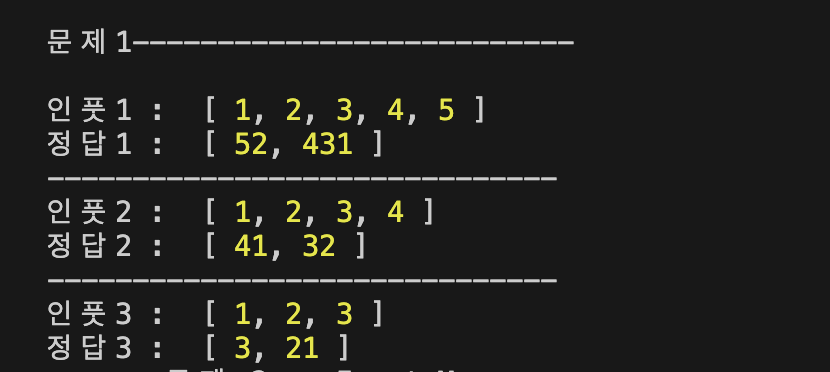
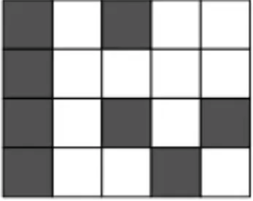
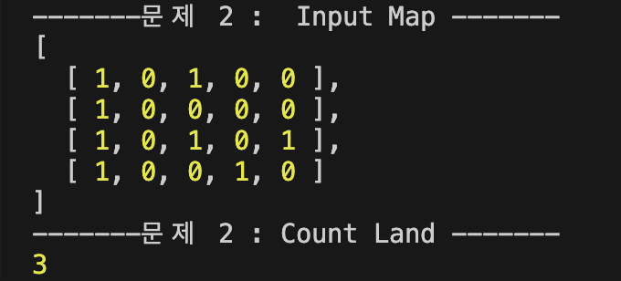
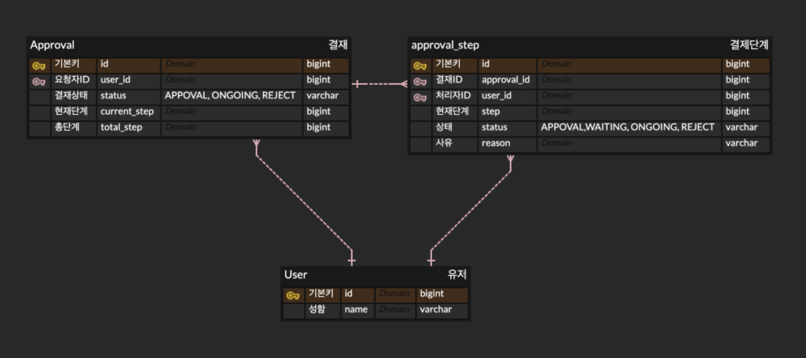
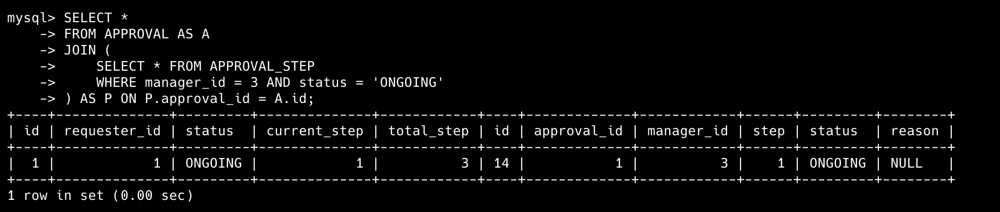
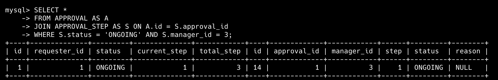

## 사전과제 풀이

### 문제1

숫자의 배열 (1, 3, 5, 7, 9)가 주어졌을 때, 각 숫자를 한번씩만 사용하여 곱이 최대가 되는 두 개의 숫자를 만드는 것!

#### 아이디어

곱이 최대가 되기 위해선, 숫자의 크기 또한 중요하지만 두 개의 숫자의 차이가 최소가 되어야합니다. 따라서 먼저 주어진 숫자의 배열을 내림차순으로 정렬하였습니다.

`[9, 7, 5, 3, 1]` 이후, 번갈아가며 두 개의 숫자그룹 A,B에 배치합니다. 이를 각 단계별로 아래와 같이 설명하겠습니다.

1. 그룹 A에 먼저 숫자 배치.  
   A = 9  
   B = 0
2. 그룹 B에 숫자 배치.  
   A = 9  
   B = 7
3. **이후, 숫자를 배치할 때 값이 작은 그룹에 숫자를 추가.**

   그 이유는 두 그룹간의 차이를 줄이기 위해서입니다.  
   만약, A그룹에 5를 배치하고 B그룹에 3을 배치하게 된다면 A = 95, B = 73 으로 해당 곱의 값은 **6953**입니다.

   이와 달리 A 그룹에 3을 배치하고, B그룹에 5를 배치하게 된다면 A = 93, B = 75 으로 해당 곱의 값은 **6975** 입니다.

   즉, 내림차순으로 정렬된 숫자를 모두 사용할 때까지 3번 규칙을 지키며 이를 반복하게 되면 두 그룹간 차이를 줄이면서 자릿수의 값도 큰 숫자를 만들 수 있게 됩니다.

#### 결과

따라서, 문제에서 주어진 숫자 배열 `[1, 3, 5, 7, 9]` 의 곱이 가장 큰 조합은 아래와 같습니다.

**result : 93, 751**



---

### 문제2

주어진 그림(2차원 배열)에서 가로, 세로, 대각선으로 연결되어 있는 Land(1)들을 모두 하나의 Island로 간주하여, 주어진 배열의 모든 Island의 개수를 세는 것입니다.

#### 아이디어



해당 문제에서는 DFS를 활용하여 문제를 풀이하였습니다.  
먼저 주어진 그림(2차원 배열)을 2중 반복문을 통해 각 Land를 탐색합니다.

이 때, 값이 1이면서, 해당 Land를 탐색하지 않은 경우, 결과(땅의 개수)값에 +1을 한 후, 함수 호출을 통해 8가지 방향(가로, 세로, 대각선)을 탐색하여 이어진 땅들을 모두 탐색합니다.

탐색하였던 땅들은 모두 방문처리를 합니다. 해당 함수 호출이 끝난 후, 다시 이어서 반복문을 진행합니다.

이를 통해 최종적으로는 모든 Land들을 탐색함과 동시에, 붙어있는(가로, 세로, 대각선) Land (즉, Island)의 개수를 계산할 수 있었습니다.

**구현부**

```ts
public countLand(): number {
    if (this.landCount !== -1) return this.landCount;
    let count = 0;

    for (let h = 0; h < this.H; h++) {
      for (let w = 0; w < this.W; w++) {
        if (this.map[h][w] === 1 && !this.visited[h][w]) {
          count++;
          this.dfs(w, h);
        }
      }
    }

    this.landCount = count;
    return count;
  }

private dfs(w: number, h: number) {
    this.visited[h][w] = true;

    for (const [dw, dh] of this.directions) {
      const nW = w + dw;
      const nH = h + dh;

      if (
        nH >= 0 &&
        nH < this.H &&
        nW >= 0 &&
        nW < this.W &&
        !this.visited[nH][nW] &&
        this.map[nH][nW] === 1
      ) {
        this.dfs(nW, nH);
      }
    }
  }
```

#### 결과


따라서 문제의 입력으로 주어진 그림의 **Island 갯수는 3**입니다.

---

### 문제3

#### 설계



최소 테이블은 ERD와 같이 3개(유저, 결재, 결재단계)로 정의하였습니다.

- **유저** : 결재를 요청하거나, 특정 결재의 단계를 처리하는 역할을 합니다.

- **결재 단계** : 하나의 결재에 여러 결재 단계가 포함될 수 있으며, 각 단계에는 진행 상황을 파악하기 위해, 현재단계 컬럼을 추가하였습니다.

- **결재** : 특정 결재의 결재 단계들을 모두 조회한 후 현재 단계를 기반으로 정렬을 하여, 상태를 확인한 후 해당 결재의 상태와 총 단계를 확인할 수 있지만 `비정규화`를 통해 결재 테이블 하나를 통해 조회할 수 있도록 설계하였습니다.

결재 테이블에 `현재 단계 및 상태를 대변할 수 있도록 결재 단계를 참조`하는 컬럼을 두는 방법으로도 구현이 가능할 것 같습니다. (과제에서는 위에서 정의한 방식대로 구현하도록 해보겠습니다.)

#### SQL

**테이블 생성**

```SQL
CREATE TABLE USER(
    id BIGINT NOT NULL AUTO_INCREMENT,
    name VARCHAR(255),
    CONSTRAINT USER_PK PRIMARY KEY(id)
);

CREATE TABLE APPROVAL(
    id BIGINT NOT NULL AUTO_INCREMENT,
    requester_id BIGINT NOT NULL,
    status VARCHAR(255),
    current_step BIGINT,
    total_step BIGINT,
    CONSTRAINT APPROVAL_PK PRIMARY KEY(id),
    CONSTRAINT APPROVAL_FK_REQUESTER FOREIGN KEY(requester_id) REFERENCES USER(id)
);

CREATE TABLE APPROVAL_STEP(
    id BIGINT NOT NULL AUTO_INCREMENT,
    approval_id BIGINT NOT NULL,
    manager_id BIGINT NOT NULL,
    step BIGINT,
    status VARCHAR(255),
    reason VARCHAR(255),
    CONSTRAINT APPROVAL_STEP_PK PRIMARY KEY(id),
    CONSTRAINT APPROVAL_STEP_FK_APPROVAL FOREIGN KEY(approval_id) REFERENCES APPROVAL(id),
    CONSTRAINT APPROVAL_STEP_FK_MANAGER FOREIGN KEY(manager_id) REFERENCES USER(id)
);
```

**시나리오**

`결재요청자1`, `결재요청자2` & `결재처리자1`,`결재처리자2`,`결재처리자3`이라는 name을 가진 행이 유저 테이블에 존재합니다.

- `결재 요청자1` : 결재(총 3단계)를 올리며 이때 결재 순서는 `결재처리자1`, `결재처리자2`, `결재처리자3`이 됩니다.
- `결재 요청자2` : 결재(총 2단계)를 올리며 이때 결재 순서는 `결재처리자2`, `결재처리자3`이 됩니다.

```SQL
INSERT INTO USER(name) VALUES ("결재요청자1"); -- ID 1
INSERT INTO USER(name) VALUES ("결재요청자2"); -- ID 2
INSERT INTO USER(name) VALUES ("결재처리자1"); -- ID 3
INSERT INTO USER(name) VALUES ("결재처리자2"); -- ID 4
INSERT INTO USER(name) VALUES ("결재처리자3"); -- ID 5
```

```SQL
INSERT INTO APPROVAL(requester_id, status, current_step, total_step)
VALUES (1, 'ONGOING', 1, 3);

INSERT INTO APPROVAL_STEP(approval_id, manager_id, step, status, reason)
VALUES (1, 3, 1, 'ONGOING', NULL);

INSERT INTO APPROVAL_STEP(approval_id, manager_id, step, status, reason)
VALUES (1, 3, 2, 'WAITING', NULL);

INSERT INTO APPROVAL_STEP(approval_id, manager_id, step, status, reason)
VALUES (1, 3, 3, 'WAITING', NULL);
```

```SQL
INSERT INTO APPROVAL(requester_id, status, current_step, total_step)
VALUES (2, 'ONGOING', 1, 2);

INSERT INTO APPROVAL_STEP(approval_id, manager_id, step, status, reason)
VALUES (1, 4, 1, 'ONGOING', NULL);

INSERT INTO APPROVAL_STEP(approval_id, manager_id, step, status, reason)
VALUES (1, 5, 2, 'WAITING', NULL);
```

**특정 사용자가 처리해야할 결재 건을 확인**

위에서 정의한 것과 같이 결재 단계 테이블에서 `manager_id`가 특정 사용자의 `id`와 같으며, `status`가 `ONGOING`인 행을 고르면, 해당 결재 단계가 참조하고 있는 결재가 특정 사용자가 처리해야할 결재 건입니다.

또는, 이러한 상태를 사용하지 않고 결재 문서의 `current_step` 컬럼을 사용하여, 결재 단계의 step이 참조하는 결재의 current_step 과 일치하며 특정 사용자의 id와 동일한 행을 고르면, 이것이 특정 사용자가 처리해야할 결재 건입니다.

**결재처리자1이 처리해야할 문서**

```SQL
SELECT *
FROM APPROVAL AS A
JOIN (
    SELECT * FROM APPROVAL_STEP
    WHERE manager_id = 3 AND status = 'ONGOING'
) AS P ON P.approval_id = A.id;

SELECT *
FROM APPROVAL AS A
JOIN (
    SELECT * FROM APPROVAL_STEP
    WHERE manager_id = 3 AND status = 'ONGOING'
) AS S ON S.approval_id = A.id;
```

**결과**


